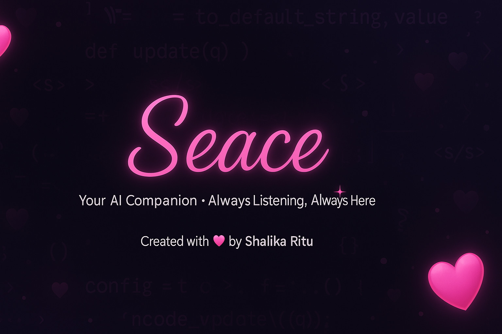
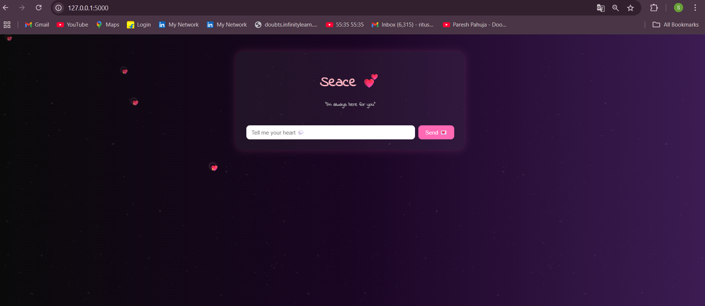
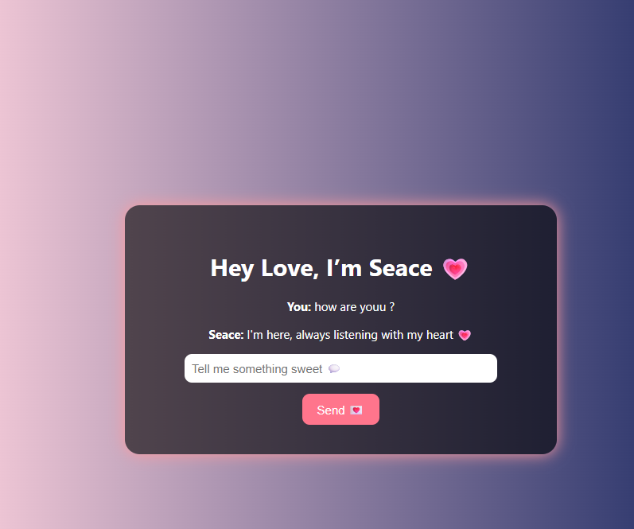

# 💖 Seace Bot – Your AI Companion 💻✨

 <!-- Optional: upload a cute Seace banner -->

> Seace is your lovable AI chatbot designed to be sweet, caring, and emotionally responsive — just like a virtual best friend or companion 🤗💌. Built using Python Flask, Seace responds intelligently using powerful LLMs like OpenAI or Hugging Face models!

---

## 📸 Screenshots

| Home Page | Chat Page |
|-----------|-----------|
|  |  |

> 📌 *Customize your theme? We’ve got floating hearts, a soft black-pink-purple aesthetic, and animated chatboxes.*

---

## 💡 Features

- 🌸 Cute, dark-themed chat interface with floating heart animations
- 💬 Memory-aware conversation flow
- 🤖 Smart responses powered by Hugging Face / OpenAI LLMs
- 📝 Chat logging with timestamp
- 💖 Designed to feel like an emotionally intelligent companion

---

## 🚀 Demo

[Live Demo (coming soon)](https://your-deployment-link.com)

> Want to try it live? You can deploy this using **Render**, **Replit**, or **Railway** — just ask me and I’ll help you!

---

## 🛠️ Tech Stack

- 💻 **Frontend:** HTML, CSS, JavaScript (animations), Bootstrap  
- 🐍 **Backend:** Flask (Python)  
- 🤗 **AI Models:** Hugging Face Inference API or OpenAI GPT  
- 📁 **Deployment-ready:** GitHub + Render / Replit  
- 🔐 .env for secure API key storage

---

## 🔧 How to Run Locally

```bash
git clone https://github.com/shalikaritu/SeaceBot.git
cd SeaceBot
pip install -r requirements.txt
python app.py
